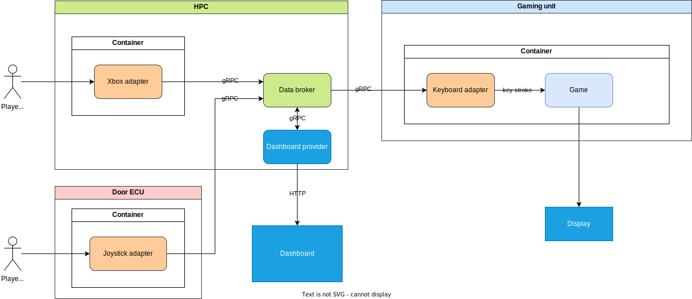

# Project overview

Welcome to GearShiftGamer Hackathon project.
This overview includes everything you need 
to know about this project along with links 
to important resources and people.

## Project description

The implementation of the Play-by-wire hackathon challenge
https://github.com/Eclipse-SDV-Hackathon-Chapter-Two/challenge-play-by-wire

## Goals

1. Define the inputs
    - Player 1 uses the Xbox gamepad
    - Player 2 uses an in-car joystick, simulated by a Raspberry Pi
2. Choose a game
    - Blobby Volley 2
        - https://sourceforge.net/projects/blobby/
        - C++ source code
3. Develop the solution architecture
    - [Diagram](solution_architecture.drawio.svg)
4. Define the interfaces
5. Implement the necessary modules, test it
6. Create the pitch slides

## Team

| Role        | Name             |
|-------------|------------------|
| Team member | Lukas Langer     |
| Team member | Muzi Xu          |
| Team member | Sebastian Probst |
| Team member | Ilja Stasewitsch |
| Team member | Pavel Spakowski  |

## Task tracker

We use this task tracker to keep track of team tasks:
https://app.slack.com/lists/T02MS1M89UH/F081NGQ3UPL

## Key resources

1. [SDV hackathon repository](https://github.com/Eclipse-SDV-Hackathon-Chapter-Two/GearShiftGamers.git)
2. [SDV product list](https://projects.eclipse.org/working-group/eclipse-software-defined-vehicle)
3. [Game Valley Blobby 2](https://sourceforge.net/projects/blobby/)
    1. Dependencies `sudo apt-get install build-essential libsdl2-dev libphysfs-dev libboost-all-dev`
4. [Ankaios](https://eclipse-ankaios.github.io/ankaios/latest/)
5. [Ankaios Dashboard](https://github.com/FelixMoelders/ankaios-dashboard/)
6. [Kuksa](https://eclipse-kuksa.github.io/kuksa-website/)
7. [Podman](https://phoenixnap.com/kb/podman-tutorial)
8. [Docker](https://www.docker.com)
9. [Python](https://www.python.org)
10. [Visual Studio Code](https://code.visualstudio.com)
11. [JetBrains PyCharm](https://www.jetbrains.com/pycharm/)

## Tool stack

* Linux OS (host OS for both Raspberry Pi's and laptop)
* C++ (game source code)
* Python 3 (adapter implementation)
* Podman (containerizing of components)
* Ankaios (orchestrating of the containers)
* Kuksa (communication between different nodes)
* Visual Studio Code and JetBrains PyCharm

## Hardware Setup

* Xbox Gamepad
* Joystick
* Display
* Local WLAN
* 2x Raspberry Pi as
    * HPC
    * Door ECU
* Linux laptop with x86 processor architecture as
    * Gaming unit
* Dedicated laptop for dashboard showcase

## Showcase/Presentation

1. Set the stage
2. Present the business case
3. Start all modules
4. Use both input interfaces to play the game
5. Give an outlook to perspectives

## Architecture



## Important architecture decisions

### Game

For purposes of the Hackathon challenge, a game should be chosen.
The following criteria should be fulfilled:

- multiplayer
- compatible with ARM and/or x86 processor architectures (source code open in the best case)
- support for Linux
- simple controls
- good attraction potential

The game [Valley Blobby 2](https://sourceforge.net/projects/blobby/)
was chosen.

### Transport layer

We use [Kuksa](https://eclipse-kuksa.github.io/kuksa-website/)
gRPC client to transport signals.

### Signal definition

We use some existing signals for transport controls 
from the input devices to the game.

Xbox-Controller:
| Signal name                         | Purpose    |
|-------------------------------------|------------|
| `Vehicle.Acceleration.Longitudinal` | Move left  |
| `Vehicle.Acceleration.Lateral`      | Move right |
| `Vehicle.Acceleration.Vertical`     | Jump       |

Adafruit-Joystick
| Signal name                         | Purpose    |
|-------------------------------------|------------|
| `Vehicle.AngularVelocity.Roll`     | Move left  |
| `Vehicle.AngularVelocity.Pitch`    | Move right |
| `Vehicle.AngularVelocity.Yaw`      | Jump       |


### Containerizing

Every module is set in a Docker container.
The container configuration is set by corresponding .dockerfile.

We use [Podman](https://phoenixnap.com/kb/podman-tutorial)
for managing the container.

We use [Docker](https://www.docker.com)
for creating the container.

An [Ankaios](https://eclipse-ankaios.github.io/ankaios/latest/)
instance is used for container orchestrating.

### Implementation toolstack

We use [Python 3](https://www.python.org) and IDE's
[Visual Studio Code](https://code.visualstudio.com) and
[JetBrains PyCharm](https://www.jetbrains.com/pycharm/)
for code developing.

### Adaptation signals for game

We simulate keyboard controls for both players.

Player 1 uses the following keys:

| Key | Purpose    |
|-----|------------|
| A   | Move left  |
| D   | Move right |
| W   | Jump       |

Player 2 uses the cursor keys:

| Key | Purpose    |
|-----|------------|
| ←   | Move left  |
| →   | Move right |
| ↑   | Jump       |

We use calls for Linux tool
[xdotool](https://github.com/jordansissel/xdotool)
to fake the keystrokes if corresponding signals
are received.

For simulation of the human key pressing, 
we send every keystroke 30 times with a delay of 1ms.

````python
str_left = f'xdotool type --delay 1 "{30*'A'}"'
````
### How to install Ankaios 
curl -sfL https://github.com/eclipse-ankaios/ankaios/releases/latest/download/install.sh | bash -

### How configurate Ankaios Server
The conent of [Service] /etc/systemd/system/ank-server.service has to be edited as:
````python
[Service]
Environment="RUST_LOG=info"
ExecStart=/usr/local/bin/ank-server --insecure -a {HOST_IP_ADDRESS:25551} --startip-config /etc/ankaois/state.yaml
````

### How configurate Ankaios Agent
The conent of [Service] /etc/systemd/system/ank-agent.service has to be edited as:
````python
[Service]
Environment="RUST_LOG=info"
ExecStart=/usr/local/bin/ank-server --insecure -s {HOST_IP_ADDRESS:25551} --name {AGENT_NAME}
````
